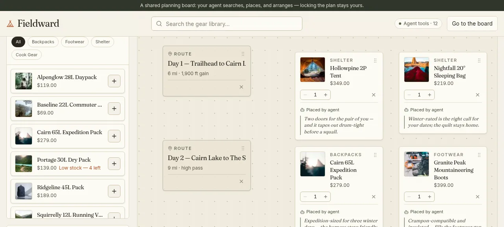
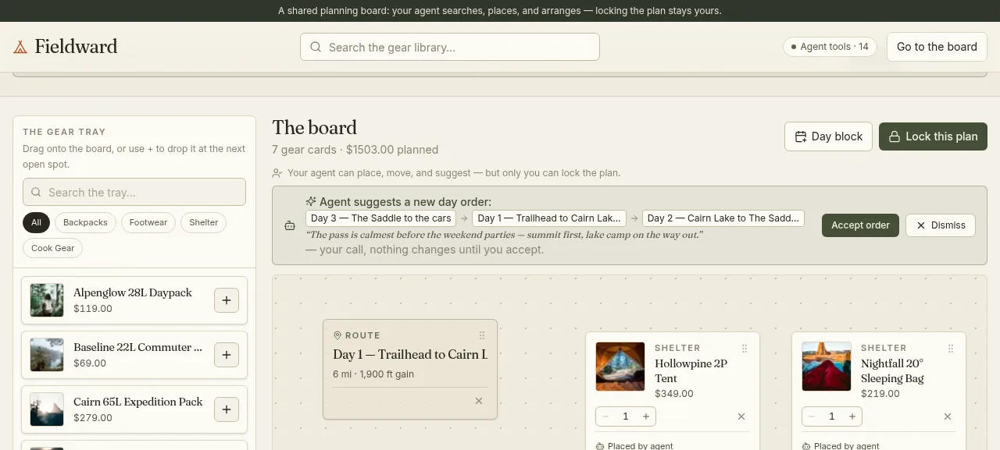

# Fieldward — One board for the long way around.

A live, shared **trip-planning board** built to demonstrate the **WebMCP open standard**: a human and their AI agent plan *one trip together* on one spatial board, in real time — gear cards, route/day blocks, and a budget line, all movable by either pair of hands. The agent searches the gear library, places its picks with its reasoning written beside them, arranges the board around the human's day blocks, grounds its advice in a **real weather outlook** for the trip's place and dates, and proposes (never writes) changes to the trip brief *and* the order of the days. **Locking the plan is never an agent tool.** It is a plain button only a human can click.

Built for **The WebMCP Challenge**.

## The one idea

Open Fieldward in a WebMCP-capable browser (or alongside a WebMCP client) and your agent gets exactly fourteen tools: it can read the trip brief, pull a real weather outlook for the trip's place and dates, search and compare gear, place cards on the board, move them, annotate its picks with a short first-person reason, check the board's readiness against the trip *and* the forecast, and catch up on what you've been doing. Everything it places animates onto the board live — exactly like your own drags — tagged **"Placed by agent"**, with a quiet toast narrating what it just did.

What the agent never gets is the final say. There is no `lock_plan` tool, no `export` tool, no `reset` tool — and no way to reach those endpoints through the tool surface. The button that locks the plan lives in a React `onClick` handler, and while a plan is locked every mutation route answers `409`, so even a rogue tool can only read. And whenever the agent wants to change something consequential — the trip brief, or the order your days run in — it doesn't overwrite anything: it leaves a pending suggestion you accept or dismiss. Same mechanism, same banner, two domains.

That boundary — agents arrange and propose, humans structure and decide — is the whole demo.



When the agent proposes a new day order, the suggestion sits above the board — the full sequence spelled out with the human's own day labels, the agent's reasoning attached — until the human accepts or dismisses it:



## The WebMCP part

Fieldward uses the raw browser API. No wrapper library:

```javascript
document.modelContext.registerTool({
  name: "place_on_board",
  description:
    "Place a gear item from the library onto the shared trip-planning board…",
  inputSchema: {
    type: "object",
    properties: {
      gearItemId: { type: "string", description: "The gear item id to place" },
      x: { type: "number", description: "Optional board x position in pixels (0–2400)" },
      y: { type: "number", description: "Optional board y position in pixels (0–1600)" },
      note: {
        type: "string",
        description:
          "A short first-person reason for this pick, shown to the user beside the card…",
      },
    },
    required: ["gearItemId"],
  },
  execute: async ({ gearItemId, x, y, note }) => {
    // calls POST /api/board/place
    // returns { success: true, item } — or { success: false, error }
  },
});
```

Registration happens once, in a top-level client component (`src/components/mcp-provider.tsx`), and every tool is unregistered individually on unmount — the raw API has no bulk unregister:

```javascript
for (const name of FIELDWARD_TOOL_NAMES) {
  await document.modelContext.unregisterTool(name);
}
```

If `document.modelContext` isn't there yet at load (some runtimes attach it late), the provider retries every 2s for 30s and also listens for a `fieldward:mcp-ready` event. Browsers without WebMCP simply get no tools — the board works fully for humans either way.

### The fourteen tools

| Tool | What it does |
| --- | --- |
| `search_gear` | Free-text search over name, description, and tags |
| `filter_gear` | Filter by category, price range (dollars), and tags |
| `get_gear_details` | Full record for one gear item id |
| `compare_gear` | Side-by-side comparison of 2–4 items |
| `place_on_board` | Put a gear item on the shared board (always attributed to the agent, optional first-person `note` rendered beside the card; omit x/y and the server picks the next open slot — the agent never does layout math) |
| `move_board_item` | Move any card — the agent's or the human's — to a new position (e.g. group cook gear under Day 2). The card glides to its new spot on the human's screen |
| `remove_from_board` | Remove one card by board-item id |
| `get_board_state` | Read the whole board: positions, notes, attribution, totals, locked state, any pending day-order proposal |
| `get_trip_brief` | Read the trip description, budget, place, and dates — the grounding document; meant to be called before searching or recommending |
| `get_weather_outlook` | The real weather outlook for the trip's place and dates (Open-Meteo, no API key): a **real daily forecast** when the trip is within ~16 days, an honest **historical seasonal average** when it's further out, or a clear "unavailable" with a reason — the state is always labeled, never blurred. Meant to be called early in a session, before searching gear |
| `propose_trip_brief_update` | Suggest a change to the trip brief — lands as a **pending proposal** the human must accept or dismiss; never overwrites |
| `suggest_day_order` | Suggest a new order for the human's day blocks (e.g. "summit day first — calmer before the storm") — lands as a **pending proposal** with the same accept/dismiss banner; the board never reorders itself, and day blocks stay human-authored (`403` for the agent, unchanged) |
| `get_activity_log` | Catch up on what the human (and agent) have been doing recently — views, placements, moves, brief edits, proposal verdicts, tool calls |
| `check_trip_readiness` | Read-only check of the board against the trip *and its weather* — one coherent result: "no winter-rated sleep system on the board", "rain likely on day 2 — no board item tagged waterproof yet" |

Every `execute` is wrapped in try/catch and returns `{ success: false, error }` instead of throwing. `place_on_board` hardcodes `addedBy: "agent"` server-side — attribution is never taken from tool input. Each tool call lands in the shared activity log, which drives both the on-screen activity strip and the `get_activity_log` tool (one source of truth).

**Deliberately absent:** any tool that can lock, finalize, export, or reset the plan. `POST /api/brief/lock` exists — it is what the human's button calls — but nothing in the tool surface references it, and `scripts/verify-mcp.ts` asserts it stays that way.

## Try it

```bash
npm install          # or: bun install
npm run db:migrate   # create db/fieldward.db from prisma/migrations
npm run db:seed      # 28 gear items (idempotent; skips if library is stocked)
npm run dev          # http://localhost:3000
```

A seeded SQLite file ships in `db/`, so the gear library is there even before you migrate or seed. For production deployment — Vercel (demo mode or persistent data), Railway, Render, Fly.io, and the database swap — see [DEPLOYMENT.md](DEPLOYMENT.md).

**To see the agent half of the demo**, open the board in a browser with WebMCP support and ask your agent something like:

- *"I'm planning a 3-day winter backpacking trip with a $500 budget — propose that as the trip brief, then build out the kit."* (propose_trip_brief_update → you accept → search_gear → place_on_board with notes)
- *"Add a day block for the summit push."* — the agent will tell you day blocks are yours to author; it can only arrange around them (a trust boundary inside the tool surface, not just around it)
- *"Compare the Ridgeline 45L and the Cairn 65L, place whichever suits a winter trip, and tell me why."* (compare_gear → place_on_board with a note)
- *"Group everything under the right days and tidy the board."* (get_board_state → move_board_item)
- *"The trip's set for the North Cascades in November — what's the weather going to do to the kit?"* (get_weather_outlook → check_trip_readiness → rain/cold gaps → waterproof and winter-rated picks)
- *"Honestly, Day 2 should come before Day 1 — the pass is safer early."* (suggest_day_order → a pending proposal with your reasoning; the human accepts and the day blocks glide into the new order)
- *"Check my board against my trip — what's still missing?"* (check_trip_readiness → suggest, never add)
- *"What have I been looking at? Anything I removed that you shouldn't re-suggest?"* (get_activity_log)

Then drag things around yourself while the agent works — you're both moving the same cards. When the plan is right, click **Lock this plan** yourself and the packing list and itinerary export unlocks. If the browser doesn't expose `document.modelContext`, the board works exactly the same for humans — the tools simply never register.

## Under the hood

**Stack:** Next.js 16 (App Router, Turbopack) · TypeScript · Tailwind CSS v4 (CSS-first `@theme`) · Prisma 7 + SQLite via the `better-sqlite3` driver adapter · dnd-kit · Zustand · shadcn/ui · lucide-react · Fraunces + Inter via `next/font`.

### The board

A bounded 2400×1600 canvas inside a scrolling frame (`src/lib/board-geometry.ts`). Cards are absolutely positioned with CSS transforms — no canvas/SVG engine. Human drags run through dnd-kit's `PointerSensor` with a `DragOverlay`; agent placements and moves go through the same REST API the tools call, and the board store's poll + event nudge makes them animate in with the exact CSS transition a human drag gets. Positions are clamped server-side, and when a tool places a card without coordinates the server scans for the next open slot.

Day blocks (the itinerary) are human-authored `BoardItem` rows — the agent can move or remove them but a `403` stops it from creating them. Budget is *not* a board row: it lives on the trip brief and renders as a derived roll-up, so there's one source of truth.

### API surface (all plain REST — the tools are a thin client of it)

| Route | Purpose |
| --- | --- |
| `GET /api/gear/search?q=&limit=` | Free-text gear-library search |
| `POST /api/gear/filter` | `{ category?, minPrice?, maxPrice?, tags? }` in dollars |
| `GET /api/gear/[id]` | One gear item, or 404 |
| `POST /api/gear/compare` | `{ gearItemIds }` — 2 to 4 ids |
| `GET /api/board?sessionId=` | The whole board: items, positions, notes, totals, locked, pending day-order proposal |
| `POST /api/board/place` | `{ sessionId, itemType, gearItemId?/label?+text?, x?, y?, quantity?, addedBy, note? }` — day blocks are human-only (`403` for agents) |
| `POST /api/board/move` | `{ boardItemId, x, y }` — clamped to the board |
| `POST /api/board/update` | `{ boardItemId, quantity?/label?+text? }` |
| `DELETE /api/board/[boardItemId]` | Remove a card |
| `GET /api/brief?sessionId=` | The trip brief + any pending proposal |
| `POST /api/brief/update` | **Human-only** (`updatedBy: "agent"` → 403) direct edit — now including the trip's place and dates |
| `POST /api/board/day-order/propose` | The agent path — stores a pending day-order suggestion (a complete re-ordering of the session's day blocks), applies nothing |
| `POST /api/board/day-order/resolve` | `{ decision: "accept" \| "dismiss" }` — the human's call; accept reassigns the day blocks' positions so the board reads in the proposed order |
| `GET /api/weather?sessionId=` | The weather outlook for the brief's place and dates — forecast / historical average / unavailable, always labeled; upstream calls are TTL-cached server-side |
| `POST /api/brief/propose` | The agent path — stores a pending suggestion, applies nothing |
| `POST /api/brief/resolve` | `{ decision: "accept" \| "dismiss" }` — the human's call |
| `POST /api/brief/lock` | **Human-only** — sets `lockedAt`; every mutation route then answers 409 |
| `POST /api/brief/reset` | **Human-only** — "start a new plan" (wipe board + brief + proposals) |
| `GET /api/activity?sessionId=&limit=&sinceMinutes=&after=` | The shared activity log (newest first) |
| `POST /api/activity/log` | `{ sessionId, actor, action, detail }` — one event |

No auth: a `sessionId` in `localStorage` scopes the board, the brief, and the activity log. The UI polls the board (1.5s) and brief/activity (2s each) — and refreshes instantly on tool-fired events — so human and agent see the same state without websockets.

### Where things live

```
prisma/schema.prisma        GearItem · BoardItem (x, y, itemType, addedBy + agent note) · TripBrief (budget, place, dates, lockedAt) · Proposal (pending suggestions, one per kind) · ActivityEvent
prisma/seed.ts              28 real gear items, 4 categories, availability flavor, verified Unsplash images
src/lib/mcp-tools.ts        the 14 tool definitions — the heart of the submission
src/lib/board-geometry.ts   board bounds, clamping, next-open-slot scan
src/lib/trip-readiness.ts   trip archetypes → expected gear; shared by the tool and the rail panel
src/lib/weather.ts          the three-state weather outlook: classifier, builders, summaries, gear-gap fold (pure, fixture-tested)
src/lib/weather-open-meteo.ts  the Open-Meteo client: geocoding, forecast, 4-year archive average, TTL caches
src/lib/proposals.ts        the generalized pending-proposal store (brief updates + day orders)
src/lib/day-order.ts        day order as spatial reading order; slot-reassignment planner
src/lib/activity.ts         single write path into the shared activity log
src/components/mcp-provider.tsx        registers/unregisters tools with document.modelContext
src/components/board/board-workspace.tsx  DndContext (tray + board), toolbar, lock flow
src/components/board/board-canvas.tsx     the 2400×1600 canvas and its cards
src/components/board/gear-tray.tsx        draggable gear library + search/filter
src/components/board/day-order-banner.tsx  the pending day-order proposal, above the board it would rearrange
src/components/trip-brief-panel.tsx       the shared brief editor (description, place, dates, budget) + weather chip + proposal banner
src/components/proposal-banner.tsx        the one accept/dismiss banner pattern both proposal domains share
src/components/weather-chip.tsx           the always-labeled outlook chip in the brief panel
src/components/board/export-view.tsx      the locked plan: packing list + itinerary + print
src/components/activity-strip.tsx         the live toast strip, driven by the activity table
src/app/api/…               the REST routes above
scripts/verify-mcp.ts       end-to-end assertions on the whole tool surface (incl. weather fixtures)
scripts/verify-loop.ts      the full human+agent collaboration loop, as one executable script
scripts/browser-e2e.sh      full browser E2E, driving the real WebMCP context
```

### Design

A planning board with a field notebook's warmth, not a dashboard: warm paper background, charcoal ink, one rust accent, moss as the quiet secondary; Fraunces serif headings over Inter body; a dot-grid work surface; gear cards that read like index cards, agent notes set as italic serif with a thin moss rule — the agent speaks, but in the board's editorial voice. lucide icons throughout, used functionally. Tokens live in one `@theme` block in `globals.css` (mirrored in `src/lib/theme.ts`) — no one-off colors.

## Verified

- `npm run build` — zero type errors, 20 routes
- `bun run scripts/verify-mcp.ts` — 135 assertions: every tool happy path *and* error path, agent attribution hardcoded, notes persisted, pending-proposal semantics (nothing applied until accepted, in **both** domains), day-order validation (unknown/gear/duplicate/partial ids all refused; slot reassignment keeps the same layout; dismiss changes nothing), the three weather states (unset, unfindable place, past dates asserted outright; forecast and seasonal-average asserted live-or-honestly-unavailable, with the parsing/averaging/gap logic pinned by Open-Meteo-shaped fixtures), locked-plan refusals for every mutating tool, register/unregister contract, and an explicit check that **no lock/export/reset/checkout tool exists**
- `bun run scripts/verify-loop.ts` — 43 assertions: the full collaboration loop as a real agent would chain it (brief → proposal → accept → day blocks → place + dates set → weather outlook → weather-folded readiness → day order proposed → accepted → proposed again → dismissed with nothing moving → grounded search → budget filter → compare → place with notes → move → readiness → gap filled → budget proposal declined → lock → agent locked out → export integrity, days in the *accepted* order)
- `bash scripts/browser-e2e.sh` — 39 checks in a real browser driving the **native** `document.modelContext` (`getTools()` + `executeTool()`): brief saved through the UI and read back through the tool, the weather chip in each of its states (unset → unfindable place → matching whatever the tool's own API returns, with its honest label), agent placements animating onto the board with attribution and notes, agent moves updating the live transform, a human tray-drag onto the board, day blocks, the brief-proposal Accept flow, the **day-order banner appearing live, accepted (the board reorders), and dismissed (nothing moves)**, lock → export view, agent mutations refused while locked, and no horizontal overflow at 390px

One environmental note, logged in [DECISIONS.md](DECISIONS.md): Open-Meteo's anonymous tier is IP-rate-limited, and the IP this project was built behind sat on an exhausted quota — so the harnesses verify the weather contract deterministically (fixtures + fallback assertions) and the live data paths whenever upstream cooperates. On a normal IP the forecast and seasonal-average states return real data.

## Scope (deliberate)

No auth, no admin panel, no payments, no in-page chatbot — the agent speaks through its own client, not through Fieldward. The gear library is reference data for planning; nothing is for sale. Locking is one-way within a session's plan ("Start a new plan" is human-only too). Swapping SQLite for Postgres in production is a contained change (`src/lib/db.ts` + `prisma.config.ts`).

## License

MIT — see [LICENSE](LICENSE). Gear photographs are served from Unsplash.
